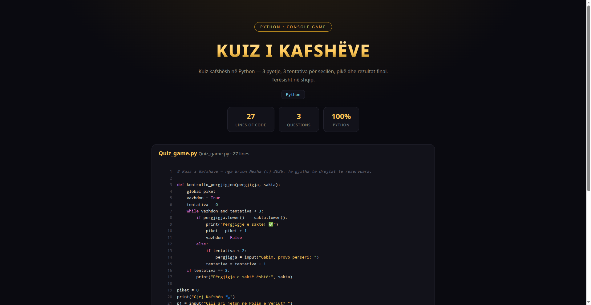

# ❓ Kuiz i Kafshëve — Quiz Game 🇦🇱

> Kuiz kafshësh në Python — 3 pyetje, 3 tentativa për secilën, pikë dhe rezultat final. Tërësisht në shqip.



**🔴 Live demo — shiko kodin:** https://erionnezha.github.io/Quiz-Game/


## 🎯 Pyetjet

1. Cili ari jeton në Polin e Veriut? → *ariu polar*
2. Cila është kafsha më e shpejtë e tokës? → *gatopardi*
3. Cila është kafsha më e madhe? → *balena blu*

## ▶️ Si ekzekutohet

```bash
python Quiz_game.py
```

## 📄 Licenca

Copyright © 2026 Erion Nezha. Të gjitha të drejtat të rezervuara. Shiko [LICENSE](LICENSE).

---

# ❓ Animal Quiz — Quiz Game 🇬🇧

> Animal quiz in Python — 3 questions, 3 attempts each, score and final result. Fully in Albanian.

**🔴 Live demo — view the code:** https://erionnezha.github.io/Quiz-Game/


## 🎯 Questions

1. Which bear lives at the North Pole? → *polar bear*
2. What is the fastest land animal? → *cheetah*
3. What is the largest animal? → *blue whale*

## ▶️ How to run

```bash
python Quiz_game.py
```

## 📄 License

Copyright © 2026 Erion Nezha. All rights reserved. See [LICENSE](LICENSE).
